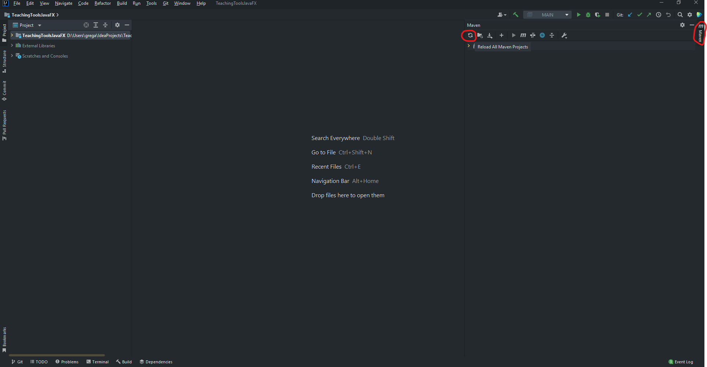
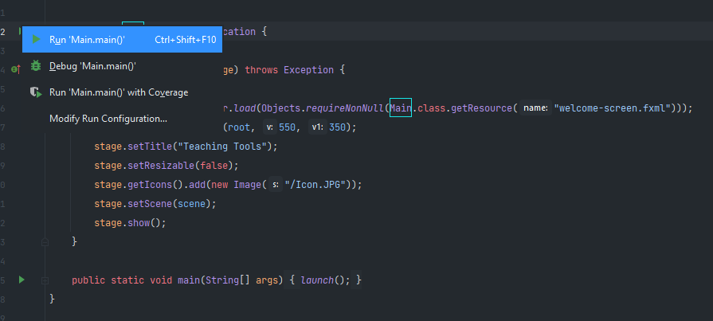

# Teaching Tool

Teaching Tool is a piece of software that was created to help students learn basic algorithms and data structures.
 
To achieve this goal, the software provides different tools such as a visualisation tool, with different playback controls,
 
and a side panel with the algorithm description, pseudocode, and explanations of every step the algorithm takes.

## Installation/Configuration
To run the program, simply open the project in the IDE, open the Maven tab on the top right, and click reload all projects to resolve the dependencies:
 

Once the dependencies have been resolved, simply navigate to the Main class (src/main/java/com.example.teachingtoolsjavafx/Main)
 
and run the Main method:

## Key Features
* Visualisation
* Playback Controls
* Pseudocode
* Step-by-step Explanations
* Variety of algorithms:
    * Bubble Sort
    * Insertion Sort
    * Selection Sort
    * Quick Sort

### Tools used

